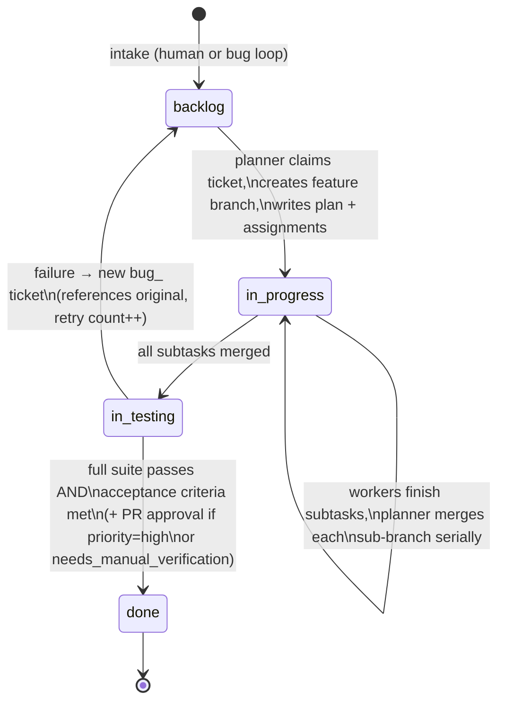

# bitfactory — Architecture (v1)

This describes the v1 design, addressing the risks raised in
[overview.md](overview.md#sanity-check-of-the-original-draft). It's the
target to build toward, not a description of what's implemented yet — see
[roadmap.md](roadmap.md) for sequencing.

## Components

| Component | Role |
|---|---|
| **Ticket store** | The `backlog/`, `in_progress/`, `in_testing/`, `done/` directories. The pipeline's state machine — a ticket's location *is* its status. |
| **Orchestrator** | The process that drives the loop: notices new/claimable tickets, invokes the planner, dispatches workers, invokes the tester. Always a single instance (see [decisions.md](decisions.md#orchestration)). What triggers it — interactive session, manual headless invocation, or a script — is the one thing still deliberately undecided; see [open-questions.md](open-questions.md). |
| **Planner agent** | Owns ticket decomposition, subtask assignment, feature-branch creation, and serialized merges of finished sub-branches. The only agent that moves tickets `backlog/ → in_progress/`. |
| **Worker agents** | Do the actual implementation + tests for one subtask, in an isolated worktree, then report back. Mostly the existing installed role agents (see [../agents/README.md](../agents/README.md)) — not bitfactory-specific. |
| **Tester agent** | Owns final validation. Moves tickets `in_progress/ → in_testing/`, runs the full suite, judges against acceptance criteria, moves to `done/` or files a `bug_` ticket. |
| **Git** | One feature branch per ticket, one sub-branch per subtask, real commits/merges. Source of truth for what changed, independent of the ticket files. |

## Ticket lifecycle



A ticket's directory location is always authoritative for its status — the
ticket file's own frontmatter (`status:`) is a convenience mirror for
grepping, not the source of truth. This avoids the class of bug where the
file says one thing and its location says another.

## Ticket ID and file format

- **ID scheme:** `<ULID-or-timestamp>-<slug>.md`, e.g.
  `01J8Z3K9F7-add-csv-export.md`. Sortable by creation time, collision-safe
  without coordination, still skimmable via the slug. (Addresses sanity-check
  point 7 — sequential numbers collide once bugs/humans/future integrations
  can all create tickets concurrently.)
- **Bug tickets:** same scheme with a `bug_` prefix on the slug, e.g.
  `01J8Z4...-bug_csv-export-crashes-on-empty-input.md`.
- **Frontmatter (YAML):**

```yaml
---
id: 01J8Z3K9F7-add-csv-export
status: backlog        # mirrors directory location, see note above
priority: medium        # low | medium | high
created: 2026-08-12
source: human            # human | bug-loop | (future) jira | github
bug_of: null              # ticket id this bug was filed against, if any
retry_count: 0            # bumped each time the bug loop re-files this lineage
feature_branch: null      # set by planner
subtasks: []               # populated by planner, see below
needs_manual_verification: false   # true if any criterion below is tagged (manual)
pr_url: null              # set by tester when it opens a PR; the signal an open,
                          # unresolved PR exists for the cross-ticket conflict check
---

## User story
As a ..., I want ..., so that ...

## Acceptance criteria
- [ ] ...
- [ ] The main window opens and displays the dashboard layout correctly (manual)
```

- **`(manual)` tag on an acceptance criterion:** marks a criterion no agent
  can check mechanically — typically something visual/interactive (a GUI
  actually rendering, layout looking right) rather than a property a test
  can assert. The planner tags these while decomposing the ticket; if any
  criterion is tagged, `needs_manual_verification` is set `true` in the
  frontmatter. The tester can also set it `true` later if it finds an
  *untagged* criterion it genuinely can't verify itself — the planner's
  pass is best-effort, not the only chance to catch this
  ([decisions.md](decisions.md#definition-of-done--human-gate)).

- **`subtasks:` entry shape** (added by the planner during planning):

```yaml
subtasks:
  - id: 1
    description: "Add CSV export endpoint"
    assigned_role: voltagent-core-dev:backend-developer
    branch: subtask/01J8Z3K9F7-add-csv-export/1
    status: pending          # pending | in_progress | done | failed -- planner sets this from the worker's report, not the worker itself
    worktree: null            # path, set when the worker starts
    merged: false             # set true by the planner once integrated (Job B)
```

## Git branching model

- One **feature branch** per ticket: `feature/<ticket-id>`.
- One **subtask branch** per worker, off the feature branch:
  `subtask/<ticket-id>/<n>` — a separate top-level namespace from
  `feature/<ticket-id>`, not nested under it. Git branch refs are
  hierarchical (like filesystem paths), so a ref can't be both a leaf and a
  directory prefix for another ref: `feature/<ticket-id>/subtask-<n>` would
  collide with `feature/<ticket-id>` itself and simply cannot be created
  once the feature branch exists. Discovered the hard way during Phase 0's
  first walkthrough, not anticipated at design time.
- Each worker gets its own **git worktree** checked out to its subtask
  branch — never a shared checkout. This is what actually delivers the
  "isolated sub-branch" requirement from the original draft; a branch name
  alone doesn't prevent two agents from clobbering each other's uncommitted
  changes in a shared working directory.
- The planner **serializes merges**: subtask branches are merged into the
  feature branch one at a time, in the order workers report completion, not
  in parallel. This makes any conflict attributable to exactly one merge and
  avoids a class of race where two concurrent merges both look clean in
  isolation but conflict with each other.
- Where possible, the planner scopes subtasks to non-overlapping
  files/modules specifically to keep merges conflict-free by construction.
  When that's not possible (e.g. two subtasks both touch a shared config
  file), the planner still dispatches them in parallel rather than
  serializing them upfront — the overlap is resolved when it actually shows
  up as a conflict during the planner's serialized merge step, not guessed
  at during planning ([decisions.md](decisions.md#git-and-merging)). This
  also means **conflict resolution is a planner responsibility**: it happens
  during integration, before the tester ever sees the feature branch.
- The tester agent works directly on the feature branch (no further
  worktree needed — it's validating the integrated result).

## Dispatching workers

The orchestrator dispatches a worker by invoking it as an agent pointed at
the worktree path the planner already created and reported
(`worktrees/<ticket-id>/subtask-<n>`) — **without** requesting the
harness's own worktree isolation for that invocation (e.g. Claude Code's
`Agent` tool has an `isolation: "worktree"` option; leave it unset here).
Passing it anyway makes the harness spin up a *second*, separate worktree
of its own for the subagent, distinct from the one bitfactory's planner
already created — the two isolation mechanisms collide: the worker's
git/write operations get scoped to the harness's worktree, not
bitfactory's, so it can't commit onto the actual `subtask/<ticket-id>/<n>`
branch directly. bitfactory's own per-subtask worktree already *is* the
isolation; the harness doesn't need to add another layer on top. Found
during Phase 0 — the worker still produced correct work, just on a stray
branch that had to be cherry-picked onto the right one by hand instead of
landing there directly.

## Concurrency and locking

- **Claiming a ticket:** the planner claims a ticket by moving its file out
  of `backlog/` — on a POSIX filesystem, `rename(2)` is atomic, so this
  doubles as the lock. Exactly one orchestrator/planner loop runs at a time
  in v1 ([decisions.md](decisions.md#orchestration)), which is what makes
  this simple lock sufficient.
- **Ticket concurrency cap: 3.** At most 3 tickets in `in_progress/`
  simultaneously, so the factory doesn't fan out unboundedly across the
  whole backlog at once. Configurable, not hardcoded — 3 is the v1 default.
- **Subtask concurrency cap: 3.** At most 3 worker agents running in
  parallel on a single ticket, same reasoning.

## Cross-ticket conflict avoidance

The planner's conflict handling above covers subtasks *within* one ticket,
resolved quickly during that ticket's own integration step. It doesn't
cover a different risk: a ticket gated at the [human gate](#human-gate)
(`priority: high` or `needs_manual_verification: true`) can sit in
`in_testing/` for an unbounded, human-dependent amount of time with its
feature branch not yet merged into `main`. Other tickets can keep landing
on `main` during that wait, raising the odds that the gated branch is hard
— or silently wrong — to merge once it's finally approved
([decisions.md](decisions.md#git-and-merging)).

Before claiming a new ticket (Job A, step 2 in the planner), the planner
checks for this:

1. Find tickets in `in_testing/` with `pr_url` set (not `null`) — these are
   the ones actually waiting on human review; an ordinary `in_testing/`
   ticket the tester is still actively validating isn't a concern, since
   that resolves within one tester pass, not an open-ended wait.
2. For each one, get its exact touched-files list:
   `git diff main...<its feature_branch> --name-only`.
3. Compare that list against the new ticket's user story for plausible
   overlap (mentioned file paths, module/feature names). This is
   necessarily a heuristic — the new ticket hasn't been decomposed yet, so
   its own touched files aren't known — but the open PR's file list is
   exact, which is the useful half of the comparison.
4. If overlap looks likely: **hold** the new ticket. Leave it in
   `backlog/` (don't claim it), append a Log entry naming which open PR it
   conflicts with, and commit that note on `main`. No overlap, or no
   PR-gated tickets currently open: claim proceeds normally.

This isn't a guarantee — it reduces the odds of a bad stale conflict, it
doesn't replace the existing "resolved at merge time" policy for whatever
still slips through. There's no separate polling loop for this yet: the
hold is simply re-evaluated the next time the planner is invoked to claim
that ticket, whatever triggers that (see
[open-questions.md](open-questions.md#orchestrator-trigger-mechanism)).

## Crash recovery

If the orchestrator is interrupted with a ticket mid-flight in
`in_progress/` (some subtasks merged, maybe an open worktree), the planner
resumes automatically on restart by re-deriving what's left to do from the
ticket's `subtasks[]` state and the feature branch's git history — no human
triage required by default. This relies on the ticket file always being
updated *before* a worktree is torn down (the planner's job, per the
report-back protocol below), so `subtasks[]` is a reliable source of truth
to resume from.

## Agent report-back protocol

A worker reports completion by:
1. Committing its work on its subtask branch (including tests) — entirely
   within its own worktree.
2. Reporting completion (or failure, with why) back to whoever invoked it.
   **The worker never edits the ticket file itself** — that file is shared
   state across all of a ticket's subtasks, and writing to it isn't scoped
   to the worker's own worktree. (An earlier version of this protocol had
   the worker do this directly; found during Phase 0 that it both violates
   the worker-guardrails write-scope below and risks a race if two
   subtasks on the same ticket finish around the same time and both try to
   edit the same file.)
3. Leaving the worktree in place until the planner has merged it (the
   planner cleans up worktrees after a successful merge).

**The planner records `status: done`** (or `failed`) on the relevant
`subtasks[]` entry, as the first step of Job B ([planner.md](../.claude/agents/planner.md))
— based on the worker's report plus its own verification that the
worktree actually has committed work. This keeps the ticket file's only
writer, for subtask bookkeeping, as the planner: one writer, no race,
and workers stay fully inside their own worktree with no carve-out needed.

## Worker guardrails

Workers run unattended (no human watching each tool call), so v1 defaults to
**tight guardrails rather than full interactive permissions**
([decisions.md](decisions.md#isolation-and-safety)):
- Bash access is allowlisted, not open-ended.
- No unrestricted network access.
- Writes are scoped to the worker's own worktree, full stop — including the
  ticket file itself (see report-back protocol above); a worker never has
  a reason to touch anything outside its worktree.

Loosen these deliberately per-role only when a specific worker genuinely
needs more (e.g. a role that must run a package manager against a real
registry), not as a blanket default.

## Secrets

The git-forge token (the local Gitea PAT for now, a GitHub PAT once the
pipeline earns that per [decisions.md](decisions.md#definition-of-done--human-gate))
is the only credential the pipeline currently needs, and it follows the same
least-privilege boundary as the guardrails above:

- **Scope:** repo access only, no admin rights on the Gitea instance —
  narrower than "throwaway instance" might tempt you into, since the token
  is still a real credential at rest.
- **Storage:** an untracked, gitignored local file or env var (or the `tea`
  CLI's own config file) — never committed, never pasted into a ticket file,
  a doc, or a script argument that'd land in shell history.
- **Who holds it:** only the planner and tester agents, since they're the
  only roles that push branches or open/merge PRs. Workers never need it —
  it's out of scope for the worker guardrails above by construction, not
  because it's separately allowlisted away from them.
- **Never logged:** it must not leak into a ticket's `## Log` section or any
  persisted command output, the same way the guardrails above keep worker
  actions from writing outside their worktree.
- **How `git push`/`pull` actually use it: a git credential helper, not a
  command-line flag.** `git config credential.helper '!f() { echo
  username=token; echo "password=$GIT_FORGE_TOKEN"; }; f'`, configured
  once per repo/machine — reads the token fresh from the env var each
  time, never writes it to disk. Deliberately *not* the
  `-c http.extraHeader="Authorization: token $GIT_FORGE_TOKEN"` flag used
  manually earlier in this project: that flag changes the command's
  prefix, which breaks a plain `Bash(git push origin *)` permission match
  under `--permission-mode dontAsk` (see
  [decisions.md](decisions.md#orchestration)). PR creation via `curl` is
  unaffected — the token there is a header *argument*, not a wrapping
  flag, so it doesn't change what the command starts with.

Storing it this way now (env var / gitignored file, planner+tester only,
never persisted) means switching from the Gitea token to a real GitHub PAT
later is a value swap in the same slot, not a rethink of how secrets flow
through the pipeline.

## Permission configuration

The guardrails and secrets scoping above are *decisions*; this is what
turns them into something Claude Code actually enforces. [`settings.json.example`](settings.json.example)
is the template — copy it to `.claude/settings.json` in the target repo
and adjust before Phase 1 headless invocation (a working copy already
exists in the sandbox target used for Phase 0).

- **What it allows:** the concrete git/worktree operations planner and
  tester actually use (`mv`, `add`, `commit`, `branch`, `worktree add/remove`,
  `merge`, scoped `push`/`pull` to `origin` only), `scripts/ticket.py`,
  running the target repo's own code/tests, and network access narrowed to
  one specific git-forge host (`curl https://YOUR-GIT-FORGE-HOST/*` —
  **edit this placeholder per target repo**, it's the one line that can't
  be copied verbatim). Writes are scoped to the ticket-store directories
  and `worktrees/**` — nowhere else, via `Edit(path/**)` rules only.
  (There's no separate `Write(path/**)` permission — Claude Code's own
  file-permission checks only look at `Edit` rules, which cover every
  file-editing tool; a `Write(...)` entry is silently never matched.
  Found this from Claude Code's own warning on a real headless run and
  dropped the dead entries rather than leaving them as confusing noise.)
- **What it denies, explicitly (defense in depth):** force-push, hard
  reset, force branch deletion, `rm -rf`, `sudo`, and `WebFetch`. Deny
  rules always win over allow rules, so these stay blocked even if a
  future allow rule accidentally overlaps.
- **The `python3 *` / `python -m *` allow entries are stack-specific to
  this template's sandbox target.** They exist so the tester can actually
  run the target repo's test suite and workers can run the app — swap them
  for whatever the target repo's real stack needs (`npm test`, `go test`,
  etc.) rather than assuming Python.
- **No `defaultMode` is set.** Deliberately — setting `"defaultMode": "dontAsk"`
  in the committed file would apply to *interactive* sessions too, silently
  auto-denying anything outside the allowlist instead of prompting a human
  who's right there watching (exactly the situation Phase 0 has mostly been
  run in so far). Headless invocations (Phase 1) should pass
  `--permission-mode dontAsk` explicitly on the command line instead, so
  interactive use keeps its normal safety net and only headless runs get
  the strict auto-deny behavior.
- **None of this matters until the workspace is trusted.** This file's
  `permissions.allow` rules are silently ignored entirely — not just for
  the specific unmatched action, *all of them* — if the target repo's
  path doesn't already have `hasTrustDialogAccepted: true` in
  `~/.claude.json`. Headless mode can't show the one-time trust dialog to
  get that set, so it has to be established beforehand: run Claude Code
  interactively in the target repo once and accept it, or set that field
  directly. This is machine-and-path-specific state, not something this
  repo's `settings.json` can carry — see
  [decisions.md](decisions.md#orchestration) for how this was found (a
  headless run stalled with a ticket half-claimed, not obviously connected
  to trust at first).
- **This isn't adversarial-proof, and isn't meant to be.** It stops the
  clearly dangerous stuff (destructive git ops, arbitrary network egress)
  and reduces prompt friction for the well-worn path; it doesn't stop a
  worker from running an allowed git command it wasn't supposed to use.
  That boundary is enforced by each agent's own instructions (`.claude/agents/*.md`)
  plus the human review at the PR gate, not by this file — consistent with
  treating these as cooperative agents following documented procedure, not
  something being defended against active misuse.

## Validation protocol (tester agent)

Two distinct checks, reported separately rather than collapsed into one
pass/fail:
1. **Mechanical:** run the full test suite (existing tests + everything
   workers added) on the feature branch.
2. **Judgment:** re-read the original user story and acceptance criteria and
   assess whether the merged result actually satisfies them — a green suite
   doesn't by itself prove this, especially for acceptance criteria that
   weren't turned into an automated test. If a criterion turns out to be
   something the tester genuinely can't verify itself, even though it
   wasn't tagged `(manual)` at planning time, it sets
   `needs_manual_verification: true` rather than guessing at a pass/fail —
   this is what routes the ticket through PR review regardless of priority.

Both must pass for the ticket to move to `done/`. A failure in either
produces a `bug_` ticket describing which check failed and why.

## Bug loop and retry cap

- A `bug_` ticket filed by the tester sets `bug_of: <original-id>` and
  `retry_count: <n+1>`, carrying the count forward from the ticket it
  replaces.
- A max retry count of **3** causes the tester to escalate to a human
  instead of filing another bug ticket, by leaving the ticket in a
  `needs_human/` directory rather than looping back to `backlog/`
  ([decisions.md](decisions.md#failure-handling)).

## Human gate

`in_testing/ → done/` uses a gate with **two independent triggers**
([decisions.md](decisions.md#definition-of-done--human-gate)) — either one
routes the ticket through PR review instead of straight to `done/`:
- **Priority:** `priority: high`.
- **Testability:** `needs_manual_verification: true` — the ticket has at
  least one acceptance criterion no agent can check mechanically (see the
  `(manual)` tag convention above).

These are deliberately kept separate rather than folded into priority: a
routine, low-priority UI tweak can still need a human to actually look at
it, without that forcing its priority up just to get reviewed. **Low- and
medium-priority tickets with no `(manual)` criteria** go straight to
`done/` automatically once the full suite passes and acceptance criteria
are judged met.

Approval happens via **PR/MR review on a git forge**: the ticket's feature
branch is pushed and opened as a PR, and approval means the PR is
approved/merged. The PR description states *why* it's gated — priority,
manual-verification criteria (quoted directly, so the human knows exactly
what to go check — e.g. "confirm the main window opens and the dashboard
layout looks right"), or both. For Phase 0/1, this targets the **local
Gitea instance** (self-hosted on the Unraid server) rather than the
`origin` GitHub remote — an unattended run's PR-opening/merging can't touch
the real repo while the pipeline is still unproven. GitHub becomes the
target once the pipeline has earned that. Either way, **a git-forge remote
is needed as soon as any gated ticket reaches `in_testing/`** — worth
remembering even in Phase 0, since this dependency arrives earlier than the
GitHub *intake* integration work planned for Phase 4 (a separate concern
from using a forge for this approval step).

There is no earlier gate in v1 — the planner's subtask breakdown is not
reviewed before workers start; only this end gate exists.

## Logging / audit trail

Log lines in the ticket file are the only persisted audit trail for v1 — no
separate full-transcript storage per ticket
([decisions.md](decisions.md#observability)). Each ticket accumulates its
own history in one place so a human can reconstruct an unattended run after
the fact:
- Git history on the feature/subtask branches (the "what changed").
- A `## Log` section appended to the ticket markdown file by each agent as
  it hands off (the "who did what, and why") — timestamped entries, not a
  full transcript.
- Where an agent's reasoning matters beyond a log line (e.g. why the tester
  judged acceptance criteria unmet), that goes in the log entry directly
  rather than only living in an agent transcript that isn't persisted
  anywhere.
